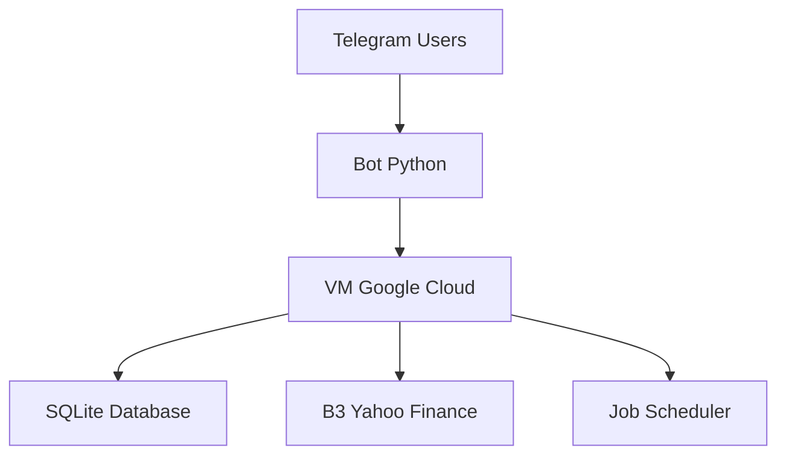

# 🤖 Bot de Alertas B3 - Telegram

Um bot inteligente para monitoramento de ações da Bolsa de Valores Brasileira (B3) com alertas em tempo real via Telegram.


## ✨ Funcionalidades

### 🎯 Para Usuários
- **Alertas Personalizados**: Configure alertas de compra/venda para qualquer ativo
- **Monitoramento 24/7**: Verificação automática de cotações
- **Relatório Diário**: Cotações de fechamento às 17:30
- **Interface Intuitiva**: Comandos simples via Telegram
- **Múltiplos Alertas**: Gerencie diversos ativos simultaneamente

### ⚡ Comandos Disponíveis
```
/set PETR4 compra 35.50 # Cria alerta de compra
/list # Lista seus alertas
/rm PETR4 compra # Remove alerta específico
/rm all # Remove todos os alertas
/help # Ajuda completa
```


### 👑 Para Administradores
- **Sistema de Whitelist**: Controle de usuários autorizados
- **Gestão de Acessos**: Ative/desative usuários
- **Monitoramento**: Acompanhe status do sistema

## 🏗️ Arquitetura



## 🚀 Tecnologias

- **Python 3.8+** - Lógica principal
- **python-telegram-bot** - Interface Telegram
- **SQLAlchemy** - ORM Database
- **yfinance** - API Cotações B3
- **Google Cloud Platform** - Hospedagem
- **SQLite** - Banco de dados

## 📦 Instalação

### Pré-requisitos
```
Clone o repositório
git clone https://github.com/seu-usuario/alerta-b3-bot.git
cd alerta-b3-bot

Ambiente virtual
python3 -m venv venv
source venv/bin/activate

Dependências
pip install -r requirements.txt
```
### Configuração
1. Crie um bot com [@BotFather](https://t.me/BotFather) no Telegram
2. Configure as variáveis de ambiente no arquivo `.env`:
```
telegram_token=SEU_BOT_TOKEN
admin_chat_id=SEU_CHAT_ID
```

### Deploy
```
python3 alerta_b3.py
```

## 🔧 Estrutura do Projeto
```
alerta-b3-bot/
├── alerta_b3.py          # Código principal
├── alertas.db           # Banco de dados
├── requirements.txt     # Dependências
├── logs/               # Arquivos de log
│   ├── bot.log
│   └── startup.log
├── scripts/            # Scripts auxiliares
│   ├── check_bot_health.sh
│   └── startup_bot_corrigido.sh
└── README.md
```
🎯 Exemplos de Uso
Criando um Alerta

Usuário: /set VALE3 compra 72.00
Bot: ✅ Alerta criado para: VALE3
     Tipo: compra  
     Valor: R$ 72.00

Recebendo Alertas
Bot: 🚨 COMPRA - VALE3 @ R$ 71.95
     Preço alvo atingido!
     Alvo: R$ 72.00 
     Atual: R$ 71.95


🤝 Contribuição
Contribuições são bem-vindas! Sinta-se à vontade para:

Fork o projeto

Criar uma branch para sua feature

Commit suas mudanças

Abrir um Pull Request          